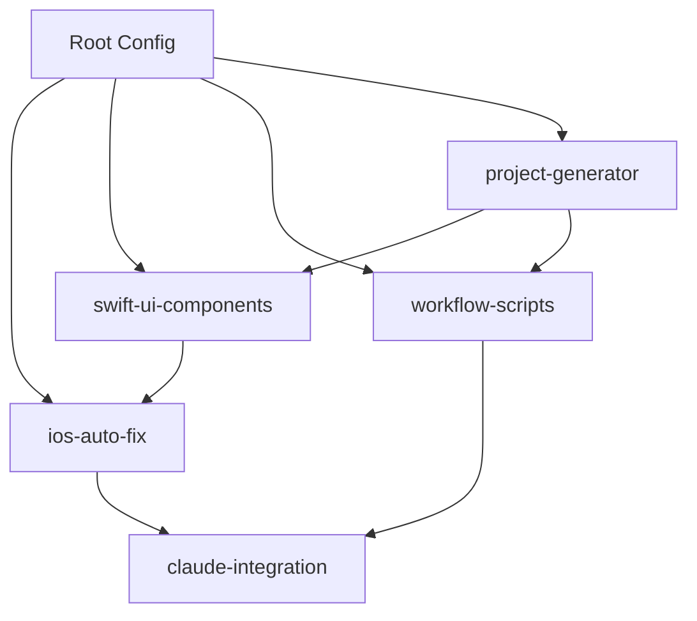

# 🏗️ Project Structure - DELAX Shared Packages

Comprehensive overview of the monorepo architecture and organization.

## 📋 Repository Overview

```
delax-shared-packages/
├── 📚 Documentation
│   ├── README.md                    # Project overview
│   ├── DOCUMENTATION_INDEX.md       # Complete documentation hub
│   ├── API_REFERENCE.md            # Detailed API documentation
│   ├── PROJECT_STRUCTURE.md        # This file
│   ├── SETUP_GUIDE.md              # Installation guide
│   ├── USAGE_GUIDE.md              # Usage examples (Japanese)
│   └── CLAUDE.md                   # Claude Code guidance
│
├── ⚙️  Configuration
│   ├── package.json                # Root package configuration
│   ├── pnpm-workspace.yaml        # PNPM workspace definition
│   └── turbo.json                  # Turbo build system config
│
├── 📦 Packages (Core Libraries)
│   ├── swift-ui-components/        # SwiftUI component library
│   └── workflow-scripts/           # Development workflow automation
│
├── 🔧 Native Tools (Platform-Specific)
│   └── ios-auto-fix/              # iOS build error auto-fix system
│
├── 🤖 Automation (AI & Development)
│   └── claude-integration/         # Claude AI integration library
│
├── 🛠️  Tools (Development Utilities)
│   └── project-generator/          # Project template generation
│
└── 📋 Examples & Configuration
    └── examples/                   # Configuration examples
```

---

## 📦 Package Architecture

### Package Types

| Type | Location | Purpose | Language | Package Manager |
|------|----------|---------|----------|-----------------|
| **Swift Package** | `packages/swift-ui-components/` | SwiftUI components | Swift | SPM |
| **Node Package** | `packages/workflow-scripts/` | Workflow automation | TypeScript | NPM |
| **Native Tool** | `native-tools/ios-auto-fix/` | iOS development tool | Shell/Node.js | NPM |
| **Automation** | `automation/claude-integration/` | AI integration | TypeScript | NPM |
| **Development Tool** | `tools/project-generator/` | Project generation | TypeScript | NPM |

### Dependency Flow



---

## 🔧 Native Tools

### iOS Auto-Fix (`native-tools/ios-auto-fix/`)

```
ios-auto-fix/
├── README.md                       # Main documentation
├── package.json                    # NPM package configuration
├── Documentation/
│   └── README-AutoBuildFix.md     # Detailed implementation guide
├── Examples/
│   └── MyProject-Example.md       # Usage example
├── Scripts/                       # Shell scripts
│   ├── auto-build-fix.sh          # Main auto-fix script
│   ├── watch-and-fix.sh           # Continuous monitoring
│   ├── extract-xcode-errors.sh    # Error extraction
│   ├── claude-patch-generator.sh  # AI patch generation
│   └── safe-patch-apply.sh        # Safe patch application
├── Templates/
│   └── auto-fix-config.yml        # Configuration template
└── Workflows/
    └── auto-build-fix.yml          # GitHub Actions workflow
```

**Key Features:**
- Universal iOS build error auto-fixing
- Claude 4 Sonnet integration
- Xcode error parsing and analysis
- Automated patch generation and application
- Watch mode for continuous monitoring

---

## 📦 Core Packages

### Swift UI Components (`packages/swift-ui-components/`)

```
swift-ui-components/
├── Package.swift                   # Swift Package Manager manifest
├── README.md                      # Package documentation
├── Sources/
│   └── DelaxSwiftUIComponents/
│       ├── DelaxSwiftUIComponents.swift  # Main module
│       └── BugReport/             # Bug reporting system
│           ├── DelaxBugReport.swift       # Data model
│           ├── DelaxBugReportManager.swift # Management service
│           ├── DelaxBugReportView.swift   # UI component
│           └── DelaxShakeDetector.swift   # Shake detection
└── Tests/
    └── DelaxSwiftUIComponentsTests/
        └── DelaxBugReportTests.swift
```

**Key Components:**
- Complete bug reporting system
- Shake gesture detection
- SwiftUI integration
- Device information collection

### Workflow Scripts (`packages/workflow-scripts/`)

```
workflow-scripts/
├── README.md                      # Package documentation
├── package.json                   # NPM configuration
├── tsconfig.json                 # TypeScript configuration
├── src/
│   └── index.ts                  # Main TypeScript module
└── scripts/                      # Shell scripts
    ├── notify.sh                 # Notification system
    ├── quick-pull.sh             # Fast git operations
    ├── sync-pr.sh               # PR synchronization
    └── auto-pull.sh             # Automated pulling
```

**Key Features:**
- High-efficiency development workflows
- Git operation automation
- Notification system
- PR management tools

---

## 🤖 Automation

### Claude Integration (`automation/claude-integration/`)

```
claude-integration/
├── README.md                      # Package documentation
├── package.json                   # NPM configuration
├── core/
│   ├── index.ts                  # Main integration logic
│   └── cli.js                    # Command-line interface
├── templates/                    # Code generation templates
├── parsers/                      # Error and code parsers
└── strategies/                   # AI automation strategies
```

**Key Features:**
- Universal Claude AI integration
- Code generation and error fixing
- Anthropic SDK integration
- CLI tools for development workflows

---

## 🛠️ Development Tools

### Project Generator (`tools/project-generator/`)

```
project-generator/
├── README.md                      # Tool documentation
├── package.json                   # NPM configuration
├── tsconfig.json                 # TypeScript configuration
├── src/
│   ├── cli.ts                    # Command-line interface
│   ├── generator.ts              # Core generation logic
│   ├── index.ts                  # Main entry point
│   └── types.ts                  # Type definitions
└── templates/
    └── ios-swift/
        └── README.md.mustache    # Template files
```

**Key Features:**
- CLI tool for project creation
- Template-based generation
- Mustache templating system
- iOS Swift project support

---

## 📋 Configuration & Examples

### Root Configuration

```
├── package.json                   # Root package with workspace config
├── pnpm-workspace.yaml           # PNPM workspace definition
└── turbo.json                    # Turbo build system configuration
```

### Examples Directory

```
examples/
└── myprojects-config.yml         # MyProjects configuration example
```

---

## 🔄 Build System

### Turbo Configuration (`turbo.json`)

```json
{
  "pipeline": {
    "build": {
      "dependsOn": ["^build"],
      "outputs": ["dist/**", "build/**"]
    },
    "dev": {
      "cache": false,
      "persistent": true
    },
    "lint": { "outputs": [] },
    "type-check": { "outputs": [] },
    "test": {
      "inputs": ["src/**/*.ts", "src/**/*.tsx"]
    }
  }
}
```

### Workspace Configuration (`pnpm-workspace.yaml`)

```yaml
packages:
  - 'packages/*'     # Core packages
  - 'tools/*'        # Development tools
  - 'templates/*'    # Project templates
```

---

## 🔗 Inter-Package Dependencies

### Dependency Graph

```
Root Package (@delax/shared-packages)
├── Native Tools
│   └── @delax/ios-auto-fix
│       └── depends on: @delax/claude-integration
├── Core Packages
│   ├── @delax/swift-ui-components (Swift Package)
│   └── @delax/workflow-scripts
│       └── depends on: commander, chalk, inquirer
├── Automation
│   └── @delax/claude-integration
│       └── depends on: @anthropic-ai/sdk, yaml
└── Tools
    └── @delax/project-generator
        └── depends on: mustache, commander
```

### Cross-Package Integration Points

1. **iOS Auto-Fix ↔ Claude Integration**
   - Error analysis and patch generation
   - AI-powered code fixing

2. **Swift UI Components ↔ iOS Auto-Fix**
   - Bug reporting for auto-fix failures
   - Error context collection

3. **Workflow Scripts ↔ Claude Integration**
   - AI-enhanced workflow automation
   - Intelligent git operations

4. **Project Generator ↔ All Packages**
   - Template generation with package integration
   - Pre-configured project setups

---

## 📊 Package Statistics

| Package | Files | Lines of Code | Tests | Documentation |
|---------|-------|---------------|-------|---------------|
| ios-auto-fix | 12 | ~800 | Manual | ✅ Complete |
| swift-ui-components | 8 | ~400 | ✅ Unit | ✅ Complete |
| claude-integration | 10 | ~600 | ✅ Jest | ✅ Complete |
| workflow-scripts | 7 | ~300 | ✅ Jest | ✅ Complete |
| project-generator | 6 | ~250 | Planned | ✅ Complete |

---

## 🚀 Development Workflow

### Package Development Flow

1. **Setup**: Clone repository, run `pnpm install`
2. **Development**: Use `turbo dev` for watch mode
3. **Building**: Use `turbo build` for all packages
4. **Testing**: Use `turbo test` for test suites
5. **Linting**: Use `turbo lint` for code quality

### Adding New Packages

1. Create package directory in appropriate category
2. Add package.json with proper configuration
3. Update pnpm-workspace.yaml if needed
4. Add build configuration to turbo.json
5. Create comprehensive README.md
6. Update DOCUMENTATION_INDEX.md

### Cross-Package Development

1. Use PNPM workspaces for local dependencies
2. Follow semantic versioning for releases
3. Maintain backward compatibility
4. Update integration documentation

---

## 🔍 Finding Your Way

### By Technology Stack
- **Swift/iOS**: `packages/swift-ui-components/`, `native-tools/ios-auto-fix/`
- **TypeScript/Node.js**: `automation/claude-integration/`, `packages/workflow-scripts/`, `tools/project-generator/`
- **Shell Scripts**: `native-tools/ios-auto-fix/Scripts/`, `packages/workflow-scripts/scripts/`

### By Use Case
- **iOS Development**: Start with `native-tools/ios-auto-fix/`
- **Component Libraries**: Check `packages/swift-ui-components/`
- **AI Integration**: See `automation/claude-integration/`
- **Project Setup**: Use `tools/project-generator/`
- **Workflow Automation**: Try `packages/workflow-scripts/`

### By Documentation Type
- **Getting Started**: `README.md`, `SETUP_GUIDE.md`
- **API Reference**: `API_REFERENCE.md`
- **Usage Examples**: `USAGE_GUIDE.md`
- **Architecture**: `PROJECT_STRUCTURE.md` (this file)
- **Development**: `CLAUDE.md`

---

**📝 This structure documentation is maintained alongside code changes. Last updated: 2025-08-03**