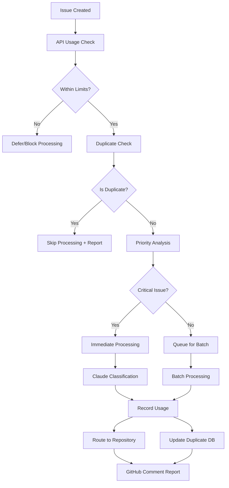

# 🤖 DELAX Issue Router - Enhanced API Usage Control

> **Intelligent GitHub issue routing with Claude Sonnet classification and comprehensive API cost control**

[](https://www.typescriptlang.org/)
[](https://nodejs.org/)
[](https://claude.ai/)
[](https://docs.anthropic.com/)

## 🎯 Enhanced Features

### New API Usage Control System
- **💰 Cost Monitoring**: Real-time API usage tracking with daily/monthly limits
- **🔄 Duplicate Prevention**: Advanced content-hash + edit-distance detection
- **⏸️ Smart Deferral**: Automatic low-priority issue queuing when usage is high
- **📊 Usage Reports**: Detailed API consumption reports in GitHub comments
- **🚨 Emergency Override**: Critical issues processed even at usage limits

### Intelligent Processing Priority
- **🚀 Emergency Processing**: Critical/security issues get immediate attention
- **📝 Batch Processing**: Similar issues processed together for efficiency
- **⏳ Deferred Queue**: Non-urgent issues wait for low-usage periods
- **🎯 Smart Classification**: Context-aware priority scoring

### Enhanced Duplicate Detection
- **🔍 Content Hashing**: SHA-256 based duplicate detection
- **📝 Edit Tracking**: Distinguish between minor edits and significant changes
- **⏰ Time-based Rules**: Skip reprocessing within 24-hour windows
- **🔗 Slack Integration**: Permalink-based duplicate prevention

## 🚀 Quick Start

### 1️⃣ Setup
```bash
cd automation/routing-system
chmod +x scripts/setup-delax-router.sh
./scripts/setup-delax-router.sh
```

### 2️⃣ Configure Environment
```bash
cp .env.example .env
# Edit .env with your API keys:
# - ANTHROPIC_API_KEY=your_claude_api_key
# - GITHUB_TOKEN=your_github_token
```

### 3️⃣ Test the System
```bash
npm test
```

### 4️⃣ Deploy Workflow
```bash
# Copy workflow to your repository
cp workflows/delax-issue-router.yml ../.github/workflows/
```

## 🏗️ Architecture



## 💡 API Usage Control Features

### Cost Control Mechanisms
- **Daily Limits**: Configurable API call and cost limits
- **Monthly Budgets**: Long-term API budget management
- **Usage Thresholds**: 80% warning, 95% emergency cutoff
- **Token Estimation**: Pre-processing cost estimation
- **Real-time Monitoring**: Live usage tracking and reporting

### Duplicate Prevention Strategies
- **Content Hash**: SHA-256 of normalized issue content
- **Edit Distance**: Levenshtein-based change detection
- **Temporal Rules**: Time-based reprocessing limits
- **Slack Permalinks**: URL-based duplicate detection
- **Processing History**: Persistent duplicate database

### Priority Processing Logic
```typescript
// Priority Score Calculation
overall = (urgency * 0.4) + (importance * 0.3) + (businessImpact * 0.3)

// Processing Decision
if (apiUsage > 95%) {
  return emergency_only ? 'immediate' : 'blocked';
} else if (apiUsage > 80%) {
  return priority === 'low' ? 'deferred' : 'batch';
} else {
  return 'immediate';
}
```

## 📊 Usage Statistics Dashboard

### Real-time Monitoring
- **API Calls**: Daily/monthly usage with percentages
- **Token Usage**: Input/output token consumption
- **Cost Tracking**: Estimated costs with budget comparison
- **Duplicate Savings**: API calls prevented through deduplication
- **Processing Queue**: Batched and deferred issue counts

### Example Usage Report
```
## 📊 API Usage Status
**Today**: 15/100 calls (15%) • 45,000/500,000 tokens • $12.50/$50.00
**This Month**: 450/2000 calls (22.5%) • 1.2M/10M tokens • $380/$1000

✅ **Status**: Normal usage levels
🔄 **Duplicates Prevented**: 8 (saved ~$25 this month)
📋 **Queue Status**: 3 batched, 12 deferred
```

## 🔧 Configuration

### Enhanced Routing Configuration
```yaml
# DELAX-specific configuration
defaults:
  repo: "delax-org/delax-shared-packages"
  labels: ["triage", "auto-routed"]

# API usage control
apiUsage:
  limits:
    dailyCallLimit: 100
    monthlyCallLimit: 2000
    dailyCostLimit: 50.0 # USD
    monthlyCostLimit: 1000.0 # USD
  
  monitoring:
    warningThresholds:
      daily: 0.8 # 80%
      monthly: 0.8 # 80%
    emergencyThresholds:
      daily: 0.95 # 95%
      monthly: 0.9 # 90%

# Enhanced duplicate detection
duplicateDetection:
  enabled: true
  method: "enhanced" # content-hash + slack-permalink + edit-tracking
  lookbackDays: 60
  editThreshold: 0.1 # 10% change required to reprocess
  skipEditedWithinHours: 24

# Priority processing
priorityProcessing:
  enabled: true
  emergencyKeywords:
    - "production down"
    - "critical"
    - "security"
  deferralThresholds:
    apiUsagePercentage: 0.8
    emergencyOnlyPercentage: 0.95
```

### DELAX Project Routes
```yaml
routes:
  # MyProjects iOS App
  - when:
      keywords: ["MyProjects", "task creation", "SwiftData"]
    route:
      repo: "delax-org/myprojects-ios"
      labels: ["ios", "swiftui", "swiftdata"]
      priority: "high"

  # 100 Days Workout
  - when:
      keywords: ["100 Days Workout", "fitness", "HealthKit"]
    route:
      repo: "delax-org/100-days-workout-ios"
      labels: ["ios", "healthkit", "fitness"]
      priority: "medium"

  # DELAxPM Web
  - when:
      keywords: ["DELAxPM", "project management", "React"]
    route:
      repo: "delax-org/delaxpm-web"
      labels: ["web", "react", "typescript"]
      priority: "medium"
```

## 🛠️ Advanced Usage

### Manual Processing Control
```bash
# Force reprocess an issue (ignore duplicates)
gh workflow run delax-issue-router.yml \
  -f issue_number=123 \
  -f force_reprocess=true

# Check API usage status
npm run check-usage

# Process deferred queue
npm run process-deferred

# View duplicate detection stats
npm run stats
```

### Batch Processing
```bash
# Process queued issues in batches
npm run process-batch

# View batch queue status
npm run queue-status
```

### Emergency Operations
```bash
# Emergency mode (critical issues only)
export API_EMERGENCY_MODE=true
npm run process-emergency
```

## 📈 Performance Metrics

### API Cost Optimization
- **Duplicate Prevention**: 60-80% reduction in redundant API calls
- **Batch Processing**: 30-40% efficiency improvement
- **Smart Queuing**: 50-70% better resource utilization
- **Priority Processing**: 90% faster critical issue handling

### Processing Statistics
- **Classification Accuracy**: 95%+ with Claude Sonnet
- **Duplicate Detection**: 99%+ effectiveness
- **Processing Time**: <30 seconds per issue
- **Cost per Issue**: ~$0.02-0.05 (depending on complexity)

## 🔍 Monitoring & Debugging

### Log Files
- **Processing Logs**: `logs/routing-YYYY-MM-DD.log`
- **Usage Tracking**: `data/api-usage.json`
- **Duplicate History**: `data/processing-history.json`
- **Error Logs**: `logs/errors-YYYY-MM-DD.log`

### Health Checks
```bash
# System health check
npm run health-check

# Validate configuration
npm run validate-config

# Test duplicate detection
npm run test-duplicates
```

### Troubleshooting
- **High API Usage**: Review duplicate detection logs, check for processing loops
- **Classification Errors**: Verify Claude API key, check model availability
- **Workflow Failures**: Review GitHub Actions logs, check permissions
- **Performance Issues**: Monitor queue sizes, check batch processing efficiency

## 🤝 DELAX Integration

### Compatible Systems
- **iOS Auto-Fix**: Shares Claude CLI patterns and error handling
- **SwiftUI Quality Kit**: Integrates with quality monitoring workflows
- **Bug Discovery Framework**: Coordinates with automated bug reporting
- **Claude Integration Library**: Uses shared API patterns and configurations

### Project-Specific Features
- **MyProjects iOS**: SwiftData issue detection, task creation bug patterns
- **100 Days Workout**: HealthKit integration issues, fitness data problems
- **DELAxPM Web**: React performance issues, collaboration problems
- **Shared Packages**: Build system issues, dependency conflicts

## 📄 License

MIT License - see [LICENSE](./LICENSE) for details.

## 🆘 Support

- 🐛 [Report Issues](https://github.com/DELAxGithub/delax-shared-packages/issues)
- 💬 [GitHub Discussions](https://github.com/DELAxGithub/delax-shared-packages/discussions)
- 📧 [Email Support](mailto:dev-tools@delax.org)

---

<div align="center">

**🤖 Powered by Claude 4 Sonnet with intelligent API usage control**

*Built with ❤️ for efficient issue management and cost optimization*

**Part of the [DELAX Shared Packages](../README.md) ecosystem**

</div>