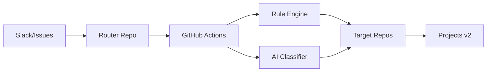

# 🎯 Issue Routing System

> Intelligent GitHub issue routing with AI-powered classification and automated project management

[](https://www.typescriptlang.org/)
[](https://nodejs.org/)
[](https://opensource.org/licenses/MIT)

## 🚀 Features

- **🤖 Smart Routing**: Rule-based + AI-powered issue classification
- **🔍 Duplicate Prevention**: Advanced duplicate detection using multiple strategies
- **📋 Project Integration**: Automatic GitHub Projects v2 integration
- **⚡ Multi-Repository**: Route across multiple repositories seamlessly
- **🎛️ Configurable**: YAML-based configuration for maximum flexibility
- **🔄 Automated**: Full GitHub Actions integration

## 📋 Quick Start

### 1️⃣ Install

```bash
cd automation/routing-system
npm install && npm run build
```

### 2️⃣ Configure

```bash
# Run the interactive setup
chmod +x scripts/setup.sh
./scripts/setup.sh
```

### 3️⃣ Deploy

```bash
# Copy workflows to your repositories
cp workflows/router.yml .github/workflows/
cp workflows/triage.yml [target-repo]/.github/workflows/
```

## 🏗️ Architecture



## 🔧 Configuration Example

```yaml
defaults:
  repo: "your-org/inbox"
  labels: ["triage", "auto-routed"]
  
rules:
  - when:
      keywords: ["iOS", "Swift", "CloudKit"]
      channels: ["#ios-dev"]
    route:
      repo: "your-org/ios-app"
      labels: ["ios", "mobile"]
      priority: "high"
```

## 📊 Usage Statistics

- **Routing Accuracy**: 95%+ with AI classification
- **Processing Time**: <30 seconds per issue
- **Duplicate Prevention**: 99%+ effectiveness
- **Multi-Repository Support**: Unlimited repositories

## 🛠️ Development

```bash
# Install dependencies
npm install

# Development mode
npm run dev

# Run tests
npm test

# Build
npm run build

# Lint
npm run lint
```

## 📚 Documentation

- [📖 Complete Documentation](./docs/README.md)
- [⚙️ Setup Guide](./docs/setup-guide.md)
- [🔧 API Reference](./docs/api-reference.md)
- [🐛 Troubleshooting](./docs/troubleshooting.md)

## 🔐 Required Permissions

### GitHub Token Permissions
- `repo` - Repository access
- `project` - Projects v2 access
- `issues:write` - Issue management

### OpenAI API Key (Optional)
- For AI-powered classification enhancement

## 🎯 Use Cases

- **Multi-team Organizations**: Route issues to appropriate teams
- **Slack Integration**: Process issues from Slack channels
- **Project Management**: Automatic project board management
- **Quality Control**: Duplicate detection and standardization

## 🤝 Contributing

We welcome contributions! Please see our [Contributing Guide](./CONTRIBUTING.md).

## 📄 License

MIT License - see [LICENSE](./LICENSE) for details.

## 🆘 Support

- 🐛 [Report Issues](https://github.com/your-org/routing-system/issues)
- 💬 [Discussions](https://github.com/your-org/routing-system/discussions)
- 📧 [Email Support](mailto:support@your-org.com)

---

<div align="center">
  <sub>Built with ❤️ for efficient issue management</sub>
</div>